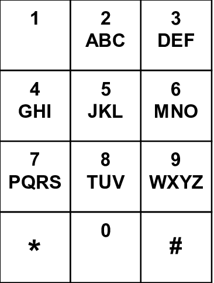

Documentation
=============

Call Center Language (or CCLang) is a strongly-typed functional programming language that mimics calling a call center service from an old brick phone.

CCLang only have 12 characters from phone keypad: 1234567890*#. All other characters in a CCLang code file (.call files) will be skipped as whitespace.

Many operators and types in CCLang are using mnemonic based on phone keypad. For example, operator ADD is 233 (A is in key 2, D is in key 3), type **I**nteger is 4 (I is in key 4).




Program
-------
Every time CCLang interpreter is called, it asks to input a digit.
- 1 : Declare a function
- 2 : Declare a type alias
- 3 : Evaluate an expression
- 0 : Finish the call (exit the interpreter)

```
    Program -> Statement+
    Statement -> FuncDecl | TypeDecl | Eval | Exit
    FuncDecl -> '1' FunctionDefinition '#'
    TypeDecl -> '2' TypeAliasDefinition '#'
    Eval -> '3' Expression '#'
    Exit -> '0'
```

Types
-----
CCLang has 10 different types:
1. None / Empty type: coded as `0`
2. Integer (I): coded as `4`
3. Float (F): coded as `3`
4. Boolean (B): coded as `2`
5. String (S): coded as `7`
6. List (L): coded as `5e`, where `e` is code of the element type. Example:
    - List of Integer is coded `54`
    - List of List of Integer is coded `554`
7. Tuple (T): coded as `8nne+`, where `nn` is the size of the tuple (from `02` to `99`), and `e+` are the codes of the element types. Example:
    - Tuple (Int, Float) is coded `80243`
    - Tuple (Int, String, List Int) is coded `8034754`
8. Function (Y, as in y(x)): coded as `9nnp*r`, where `nn` is the size of parameters (from `00` to `99`), `p*` are the codes of the parameter types, and `r` is the code of the return type. Example:
    - Function `() -> Int` is coded `9004`
    - Function `(Int, String) -> List Boolean` is coded `9024752`
9. Option / Sum types (O): coded as `6nnt+`, where `nn` is the number of options (from `02` to `99`), and `t+` are the codes of the types. Example:
    - Type `Int | String` is coded `60247`
    - Type `String | List Float | None` is coded `6037530`
10. Type alias: coded as `1nnn`, where `nnn` is the id of the alias (from `000` to `999`).
```
    TypeExpr -> BaseType | ListType | TupleType | FunctionType | OptionType | AliasType
    BaseType -> '0' | '4' | '3' | '2' | '7'
    ListType -> '5' TypeExpr
    TupleType -> '8' [0-9]{2} TypeExpr+
    FunctionType -> '9' [0-9]{2} TypeExpr* TypeExpr
    OptionType -> '6' [0-9]{2} TypeExpr+
    AliasType -> '1' [0-9]{3}
```

Declaring a type alias follows this grammar
```
    TypeAliasDefinition -> '*' '1' AliasID '*' TypeExpr
    AliasID -> [0-9]{3}
```

For example, a statement for declaring a type alias with id 12 to a Tuple (Int, Float) looks like this:
```
    2*1012*80243#
```

Function Declaration
--------------------
Defining a function follows this grammar
```
    FunctionDefinition -> '*' FunctionID '*' NumParams Params* '*' ReturnType '*' Expression
    FunctionID -> [0-9]+
    NumParams -> [0-9]+
    Params -> '*' TypeExpr
    ReturnType -> TypeExpr
```

Inside the expression, parameters is available as a variable with id 0, 1, etc.

Examples:
1. A statement for declaring a function with id `22` of type `() -> Int` that only returns the number `23` looks like this:
```
    1*22*0*4*23#
```

2. A statement for declaring a function with id `987` of type `(Int, Float) -> Int` that only returns the number `5678` looks like this:
```
    1*987*2*4*3*4*5678#
```

3. Suppose that expression `arg_0 + 1`, arg_0 being the first argument of a function, is coded as `*233**00*1`. A statement for declaring a function with id `10` of type `(Int) -> Int` that return the first argument plus one should look like this:
```
    1*10*1*4*4**233**00*1#
```

Expression
------------------------
An expression is either a number or a call. A number expression is any natural number (non-negative integer).

```
    Expression -> Number | Call
    Number -> [0-9]+
```

A call of operator is either a call to built-in operators, a call to user defined function, or a variable dereferencing. A call always starts with an asterisk
```
    Call -> '*' (BuiltIns | FunCall | Var)
```

### Function Call
A function call follows this grammar:
```
    FunCall -> '1' FunctionID Argument*
    FunctionID -> [0-9]+
    Arguments -> '*' Expression
```

For example, a call to function with id `123` like with an argument `1000` (like `fun_123(1000)` in other languages) looks like this:
```
    *1123*1000
```

### Variable Dereferencing
Dereferencing variable follows this grammar
```
    Var -> '0' VariableID
    VariableID -> [0-9]+
```

For example, dereferencing a variable with id `23` looks like this:
```
    *023
```

### Built In Operators and Function
1. **ADD** (233), type (Int, Int) -> Int | (Int, Float) -> Float | (Float, Int) -> Float | (Float, Float) -> Float

    ADD(a, b) adds two numbers (integer or float) a and b.

    Syntax: `ADD -> '233' '*' Expression '*' Expression`

2. **SUB** (782), type (Int, Int) -> Int | (Int, Float) -> Float | (Float, Int) -> Float | (Float, Float) -> Float

    SUB (a, b) subtract two numbers (integer or float) a and b.

    Syntax: `SUB -> '782' '*' Expression '*' Expression`

3. **MUL** (685), type (Int, Int) -> Int | (Int, Float) -> Float | (Float, Int) -> Float | (Float, Float) -> Float

    MUL(a, b) multiply two numbers (integer or float) a and b.

    Syntax: `MUL -> '685' '*' Expression '*' Expression`

4. **DIV** (348), type (Int, Int) -> Int | (Int, Float) -> Float | (Float, Int) -> Float | (Float, Float) -> Float

    DIV(a, b) divide two numbers (integer or float) a and b. May produce runtime error on division by zero.

    Syntax: `DIV -> '348' '*' Expression '*' Expression`

5. **MOD** (663), type (Int, Int) -> Int

    MOD(a, b) returns division remainder between two integers a and b. May produce runtime error on division by zero.

    Syntax: `MOD -> '663' '*' Expression '*' Expression`

6. **EQ** (37), type (a, a) -> Bool

    EQ(a, b), compare two values of same type, produce true if left equals right.

    Syntax: `EQ -> '37' '*' Expression '*' Expression`

7. **NE** (63), type (a, a) -> Bool

    NE(a, b) compare two values of same type, produce true if left is not equal right.

    Syntax: `NE -> '63' '*' Expression '*' Expression`

8. **LT** (58), type (a, a) -> Bool

   LT(a, b) compare two values of same type, produce true if left is less than right.

    Syntax: `LT -> '58' '*' Expression '*' Expression`

9. **GT** (48), type (a, a) -> Bool

   GT(a, b) compare two values of same type, produce true if left is greater than right.

    Syntax: `GT -> '48' '*' Expression '*' Expression`

10. **LTE** (583), type (a, a) -> Bool

    LTE(a, b) compare two values of same type, produce true if left is less than or equal to right.

    Syntax: `LTE -> '583' '*' Expression '*' Expression`

11. **GTE** (483), type (a, a) -> Bool

    GTE(a, b) compare two values of same type, produce true if left is greater than or equal to right.

    Syntax: `GTE -> '483' '*' Expression '*' Expression`

12. **AND** (263), type (Bool, Bool) -> Bool

    AND(a, b) produce the value of left && right. Will short circuit if left is false.

    Syntax: `AND -> '263' '*' Expression '*' Expression`

13. **OR** (67), type (Bool, Bool) -> Bool

    OR(a, b) produce the value of left || right. Will short circuit if left is true.

    Syntax: `OR -> '67' '*' Expression '*' Expression`

14. **NEG** (634), type (Int) -> Int | (Float) -> Float

    NEG(x) return negative of x (integer or float).

    Syntax: `NEG -> '634' '*' Expression`

15. **NOT** (668), type (Bool) -> Bool

    NOT(x) return not value of x.

    Syntax: `NOT -> '668' '*' Expression`

16. **INT** (468), (Float) -> Int

    INT(x) convert float x to integer.

    Syntax: `INT -> '468' '*' Expression`

17. **FLO** (356), (Int) -> Float

    FLO(x) convert integer x to float

    Syntax: `FLO -> '356' '*' Expression`

18. **STR** (787), (a) -> String

    STR(x) convert x of any type to string.

    Syntax: `STR -> '787' '*' Expression`

19. **LIST** (5478), (typeExpr as a, literal Int, a...) -> List a

    LIST(t, nn, e...) build a list of type t, from nn number of element expressions.

    Syntax:
    ```
        LIST -> '5478' '*' TypeExpr '*' Length Argument*
        Argument -> '*' Expression
        Length -> [0-9]+
    ```
20. **APP** (277), type (a, List a) -> List a | (List a, a) -> List a | (List a, List a) -> List a | (String, Int) -> String | (Int | String) -> String | (String | String) -> String

    APP(x, list) append x to the front of list.
    APP(list, x) append x to the back of list.
    APP(list1, list2) joins list1 and list2.

    APP(n, str) append character of code n to the front of string s.
    APP(str, n) append character of code n to the back of string str.
    APP(str1, str2) append strings str1 and str2.

    Syntax: `APP -> '277' '*' Expression '*' Expression`

21. **GET** (438), type (List a, Int) -> a | (String, Int) -> String

    GET(list, idx) returns an element of list or a character from a string at index idx. May produce index out of bound runtime error.

    Syntax: `GET -> '438' '*' Expression '*' Expression`

22. **SET** (738), type (List a, Int, a) -> List a | (String, Int, String | Int) -> String

    SET(list, idx, val) sets an element of list or a character in a string at index idx with val. May produce index out of bound runtime error.

    Syntax: `SET -> '738' '*' Expression '*' Expression '*' Expression`

23. **LEN** (536), type (List a | String) -> Int

    LEN(x) returns length of a list or a string.

    Syntax: `LEN -> '536' '*' Expression`

24. **CHRS** (2488), type (List Int) -> String

    CHRS(l) converts a list of integers representing character codes to a string.

    Syntax: `CHRS -> '2488' '*' Expression`

25. **TUP** (887), (literal Int, a1, a2, ...) -> Tuple (a1, a2, ...)

    TUP(nn, e...) build a tuple from nn number of element expressions.

    Syntax:
    ```
        TUP -> '887' '*' Length Argument+
        Argument -> '*' Expression
        Length -> [0-9]+
    ```

26. **TGET** (8438), type (Tuple a, literal Int) -> a

    TGET(t, nn) gets an element at nn from a tuple

    Syntax:
    ```
        TGET -> '8438' '*' Expression '*' Index
        Index -> [0-9]+
    ```

27. **TSET** (8738), type (Tuple a, literal Int, a) -> Tuple a

    TSET(t, nn, val) sets an element at nn in a tuple to val.

    Syntax:
    ```
        TSET -> '8738' '*' Expression '*' Index '*' Expression
        Index -> [0-9]+
    ```

28. **IF** (43), type (Bool, a, b) -> a | b

    IF(c, a, b) return expression a if condition c is true, otherwise return expression b.

    Syntax: `IF -> '43' '*' Expression '*' Expression '*' Expression`

29. **LET** (538), type (literal Int, a, b) -> b

    LET(id, val, expr) creates a variable of ID id with value val, and then evaluates expr with the variable in context. Similar to `let id = val in expr` in Haskell.

    Syntax:
    ```
        LET -> '538' '*' Index '*' Expression '*' Expression
        Index -> [0-9]+
    ```
30. **IFL** (435), type (literal Int, typeExpr as t, t, a, b) -> a | b

    IFL(id, t, val, a, b): If val can be casted to type t, then creates a variable of ID id with value val, then evaluates a with the variable in context. Otherwise, evaluates b. Similar to `if let ... = ...` in Rust.

    Syntax:
    ```
        IFL -> '435' '*' Index '*' TypeExpr '*' Expression '*' Expression '*' Expression
        Index -> [0-9]+
    ```

Example
-------
Factorial program
```
1*3*1*4*4**43**37**00*0*1**685**00**13**782**00*1#3*13*5#0
```
with comments and spacing (also executable!):
```
function with id three, has one int parameter, and returns int
1*3*1*4*4*
  *43                           if
    **37**00*0                  argument zero equals zero
    *1                          then return one
    **685                       else multiply
      **00                              arg zero with
      **13*                               call function three with argument
        *782**00*1#                             arg zero minus one

evaluate call function three with argument five
3*13*5# should return one hundred twenty
0 exit
```
