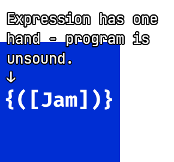

# Live Demo

[willmcpherson2.com/two-hand-demo](http://willmcpherson2.com/two-hand-demo)

# Dependencies

- cabal
- ghc

https://www.haskell.org/downloads/

# Usage

```sh
$ cabal run two-hand -- examples/langjam.th

error at 0:0
Expression has one hand - program is unsound.
All expressions should have two hands, e.g. (f x)
↓
{([Jam])}
```

# Tutorial

In Two Hand, all expressions have two hands.

Let's define something:

[function.th](examples/function.th)
```
{main [x x]}
```

The left hand of a definition is a name and the right hand is an
expression.

Here the expression is a function `[x x]`. The left hand is a
parameter and the right hand is an expression. This function just
takes something and returns it.

The interpreter will print `[x x]`. This is because a function
evaluates to itself.

Let's extract that function:

[application.th](examples/application.th)
```
{id [x x]}

{main (id id)}
```

To call our new `id` function, we use application `(id id)`. Both
hands of an application are expressions.

The interpreter prints `[x x]`.

And that's all.

> But what about multiple arguments?

[multiple-arguments.th](examples/multiple-arguments.th)
```
{const [x [y x]]}

{main ((const [a a]) [b b])}
```

Result: `[a a]`

> But how do I write Hello World?

[hello-world.th](examples/hello-world.th)
```
{main [hello [world [! !]]]}
```

Result: `[hello [world [! !]]]`

> But what about `if`?

[if.th](examples/if.th)
```
{true [x [y x]]}

{false [x [y y]]}

{not [x ((x false) true)]}

{if [bool [a [b ((bool a) b)]]]}

{main (((if (not true)) [a a]) [b b])}
```

Result: `[b b]`

> But what about data structures?

[list.th](examples/list.th)
```
{nil [_ [x x]]}

{cons [x [xs
  [f [_ ((f x) xs)]]]]}

{map [f [xs
  ((xs
    [x [xs ((cons (f x)) ((map f) xs))]])
    nil)]]}

{last [xs
  ((xs
    [x [xs
      ((xs
        [_ [_ (last xs)]])
        x)]])
    nil)]}

{true [x [y x]]}

{false [x [y y]]}

{not [x ((x false) true)]}

{trues ((cons true) ((cons true) nil))}

{main (last ((map not) trues))}
```

Result: `[x [y y]]`

> But what about numbers?

[numbers.th](examples/numbers.th)
```
{0 [f [x x]]}

{1+ [n
  [f [x (f n)]]]}

{+ [x [y
  ((x
    [n (1+ ((+ n) y))])
    y)]]}

{true [x [y x]]}

{false [x [y y]]}

{> [x [y
  ((x
    [n
      ((y
        [m ((> n) m)])
        true)])
    false)]]}

{1 (1+ 0)}

{2 ((+ 1) 1)}

{main ((> 2) 1)}
```

Result: `[x [y x]]`
